# Go Datagrid Component (v1.5.1)

A high-performance, metadata-driven datagrid component library for Go and HTMX, optimized for PostgreSQL. Built for high-density, expert-centric interfaces with a strict **No-Tailwind** architectural identity.

## 🏗️ Architecture

```mermaid
graph LR
    CATALOG["📋 JSON Catalog"] --> RENDER["⚙️ datagrid.Render()"]
    RENDER --> SQLGEN["SQL Generator"]
    RENDER --> FILTER["Filter Engine"]
    RENDER --> SORT["Sort Engine"]
    SQLGEN --> DB["🐘 PostgreSQL"]
    DB --> HTMX["🖥️ HTMX Partial"]
    HTMX --> APP["📦 Consumer App<br/>(Jiramntr, Johanna)"]
```



> Full architecture diagram: [docs/datagrid_architecture.mmd](docs/datagrid_architecture.mmd)

## 🚀 Premium Features

- **Metadata-Driven UI**: Configure columns, labels, icons, and behavior using localized JSON catalogs.
- **Advanced Filtering & Search**:
  - **Multi-Column Filtering**: Combine dropdown filters with global search for precision data mining.
  - **Advanced Search**: Configurable search columns, operators, and transactional similarity thresholds (`pg_trgm`).
  - **Default Filters**: Define default filter states in the catalog for instant specialized views.
- **Expert Minimalist Sorting**: 
  - 3-phase sorting (ASC -> DESC -> NONE) with rank indicators.
  - Multi-column support (Ctrl+Click).
  - **Advanced Postgres Sorting**: Full support for `NULLS FIRST` and `NULLS LAST` directives.
  - **Dynamic JSON Sorting**: Sort by nested JSON paths using the `dyn-` prefix (leveraging Postgres `->>` operator).
- **Robust SQL Generation**:
  - Automatic double-quoting of identifiers to prevent collisions with reserved keywords.
  - Parentheses wrapping for complex searchable column expressions.
- **Forensic DOM Standard**:
  - Rows tagged with `data-json` containing the full record metadata.
  - Cells tagged with `.col-{field}` for easy CSS targeting and scraping.
  - Integrated `escapeClass` logic for deterministic selection of nested JSON fields.
- **High-Density UI & Styling**:
  - **Record Detail Panel**: Integrated right-sidebar for high-density metadata inspection.
  - **CSS-Based Zebra Striping**: Modern, theme-aware row shading using `nth-child` selectors (no inline styles).
  - **JSON Key Expansion**: Dynamically expand nested JSON objects into table columns at runtime.
- **Persistence Layer**: Automatic persistence of column visibility, width, order, and sorting in `localStorage`.
- **Pivot Table**: Analytical mode for data aggregation and cross-tabulation with subtotals.
- **Comprehensive Testing Tools**:
  - Built-in data generator (`scripts/generate_data.py`) creating realistic, relational datasets for stress testing.

## 🛠 Architectural Identity

- **No-Tailwind Policy**: Built with pure CSS semantic classes (`dg-*`) to ensure standalone reliability and zero-dependency styling.
- **Design Tokens**: Standardized shadow (dg-shadow), radius (dg-radius), and Inter typography.
- **HTMX Native**: Zero-refresh updates, pagination, and filtering using HTMX standard triggers.

## 📋 Catalog Configuration

The datagrid behavior is defined by its JSON catalog, validated against the [`datagrid.schema.json`](internal/data/schemas/datagrid.schema.json). See [docs/catalog_format.md](docs/catalog_format.md) for the full specification.

```json
"searchable": {
    "columns": ["name", "email", "(data->>'role')"],
    "operator": "%",
    "threshold": 0.3
}
```

## 🏗 Setup & Installation

### Prerequisites
- Go 1.25+
- PostgreSQL with `pg_trgm` extension enabled.
- GPG (for environment vault operations).

### Quick Run
```bash
./build_run.sh
```

### Environment Management

The project uses **GPG-encrypted environment templates** for safe, multi-machine secret sharing (ported from jiramntr).

```text
opt/envs/
├── .env_zenbook           # Machine-specific config
├── .env_zenbook.gpg       # Encrypted (committed to Git)
├── .env_IT-2057-butalam   # Butalam server config
└── .env_IT-2057-butalam.gpg
```

**Switch environment** (auto-detects hostname or specify explicitly):
```bash
./scripts/switch_env.sh              # Auto-detect by hostname
./scripts/switch_env.sh zenbook      # Explicit switch
```

**Vault operations** (GPG AES256 encryption):
```bash
./scripts/vault.sh lock   opt/envs/.env_zenbook   # Encrypt
./scripts/vault.sh unlock opt/envs/.env_zenbook   # Decrypt
./scripts/vault.sh status zenbook                 # Check sync (shortcut)
./scripts/vault.sh verify zenbook                 # SHA256 integrity check
./scripts/vault.sh diff   zenbook                 # Diff raw vs encrypted
```

Set `VAULT_PASS` in your shell or create `~/.vault_pass` for non-interactive use.

### Deployment (Butalam)

Deploy to the butalam LAN server via SSH:
```bash
./scripts/deploy_butalam.sh
```

This script:
1. Switches environment to `IT-2057-butalam`
2. Cross-compiles Linux amd64 binary
3. Packages binary + config + UI + catalogs
4. Transfers via SCP and installs to `/opt/datagrid`
5. Sets up systemd service and restarts
6. Runs health check

### `.env` Variables

| Variable | Description | Example |
| :--- | :--- | :--- |
| `DB_HOST` | PostgreSQL host | `localhost` |
| `DB_PORT` | PostgreSQL port | `5433` |
| `DB_USER` | Database user | `root` |
| `DB_PASSWORD` | Database password | `soa123` |
| `DB_NAME` | Database name | `db01` |
| `DB_SCHEMA` | Default schema | `datagrid` |
| `DB_MODE` | Execution mode | `normal` or `refcursor` |
| `ENV_NAME` | Active environment name | `zenbook` |
| `CATALOG_PATH` | Override catalog JSON path | `internal/data/catalog/personnel.json` |

## 📂 Project Structure

```
datagrid/
├── cmd/                    # Application entry points
│   ├── cursorapp/          #   Cursor-mode app (default deploy target)
│   ├── testapp/            #   Standard test app
│   ├── dbtest/             #   Database connectivity test
│   └── validate/           #   JSON catalog validator
├── internal/data/
│   ├── catalog/            # JSON catalog definitions (26 files)
│   └── schemas/            # JSON Schema validation files
├── ui/                     # HTML templates, CSS, JS
├── scripts/
│   ├── vault.sh            # GPG vault manager
│   ├── switch_env.sh       # Environment switcher
│   ├── deploy_butalam.sh   # Butalam deployment
│   └── ...
├── deploy/
│   ├── datagrid.service    # Systemd unit file
│   └── install.sh          # Remote installer
├── opt/envs/               # Environment templates (.gpg committed)
├── datagrid.go             # Core library
├── pivot.go                # Pivot table engine
├── config.yaml             # Application configuration
└── build_run.sh            # Development entry point
```

## 📄 Documentation
- [Project Documentation](docs/project_documentation.md) — Architecture, SQL modes, streaming
- [Catalog Format](docs/catalog_format.md) — JSON catalog specification

## License
MIT
